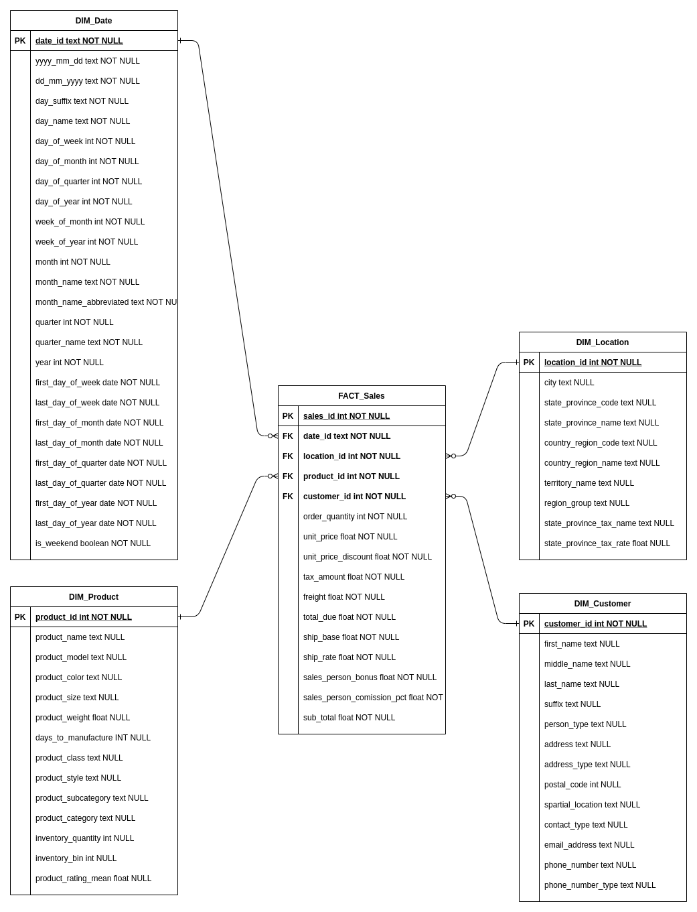

# Adventure Works DW Project

## Introduction

This project is intended to create a data warehouse architecture from Adventure Works data. The database is 3º normal form and we will transform it to a snow flake schema

## Objective

Our goals is creating some architecture that could easily queried and understandable by business people. With that in mind, we want to awnser a few questions about the data:

* Which city has more sales at first quarter of the year
* Days of week with more sales
* Customers from Canada who has buy more products
* Sum and quantity of sales between weekend days and normal days
* Week of month with more sales in US

## Starting guide

First of all, we need a postgres database to store our data, we'll use a Docker image to work with

To run a docker container for postgres locally:<br>
`docker run --name postgres-dw -p 5432:5432 -e POSTGRES_PASSWORD=advworks_dw_123 -e POSTGRES_USER=advworks_dw -e POSTGRES_DB=AdventureWorks -d postgres`

Now we need to create and populate tables in our database with AdventureWorks data, to do that, just run *setup.sh* script in main folder passing argument as docker container name:<br>

`sh setup.sh postgres-dw`

The script will check if there's 2 folders and 1 file in directory:
* **data** folder: Data from AdventureWorks database in CSV format
* **install.sql** file: It's the principal script who will create and populate postgres database with AdventureWorks data in data folder
* **sql-dw-scripts** folder: Scripts to create and populate dimensional tables from our Data Warehouse modelling


After that you can check if data is there<br>
`docker exec -it postgres-dw psql -U advworks_dw -d AdventureWorks -c "SELECT * FROM sales.store LIMIT 5"`

`docker exec -it postgres-dw psql -U advworks_dw -d AdventureWorks -c "SELECT * FROM dw.fact_sales LIMIT 5"`

<br>

Here's a Entity Relationship Diagram from Adventure Works:


And I created a new dimensional model that end up like this:



This is a robust schema that can be used for analytics insights, easy to use and mantain, with no needs hard etl works to get some useful data.

Now we can easily answer previously questions with simple SQL queries

<br>

* **Which city has more sales at first quarter of the year**
```sql
select 		lo.city,
			sum(sa.sub_total) as total
from 		dw.fact_sales sa
join 		dw.dim_location lo on lo.location_id = sa.location_id
join 		dw.dim_date da on da.date_id = sa.date_id
where 		da.quarter = 1
group by 	lo.city
order by 	2 desc 
limit 		5
```
|city|total|
|-|-|
|Toronto|1145053.05|
|London|567720.19|
|Paris|509254.32|
|Seattle|398973.46|
|Burnaby|386379.36|
<br>

* **Days of week with more sales**
```sql
select 		da.day_name,
			sum(sa.sub_total) as total
from 		dw.fact_sales sa
join 		dw.dim_date da on da.date_id = sa.date_id
group by 	da.day_name
order by 	2 desc 
```
| day_name | total |
|-|-|
Monday | 19122816.27
Wednesday | 18707694.04
Saturday | 16820609.98
Sunday | 14968303.72
Thursday | 14698321.68
Tuesday | 14502145.52
Friday | 11553998.07
<br>

* **Customers from Canada who has buy more products**
```sql
select 		cu.first_name,
			cu.last_name,
			sum(sa.order_quantity) as total
from 		dw.fact_sales sa
join 		dw.dim_customer cu on cu.customer_id = sa.customer_id
join 		dw.dim_location lo on lo.location_id = sa.location_id
where 		lo.country_region_code = 'CA'
group by 	cu.first_name,
			cu.last_name
order by 	3 desc 
limit 		5
```
| first_name | last_name | total_products |
|-|-|-|
Reuben | D'sa | 2737
Marcia | Sultan | 2350
Della | Demott Jr | 1963
Ryan | Calafato | 1931
Yale | Li | 1843
<br>

* **Sum and quantity of sales between weekend days and normal days**
```sql
select 		case 
                when da.is_weekend = false then 'Not Weekend' 
                else 'Weekend' 
            end as weekend,
			count(*) as quantity,
			sum(sa.sub_total) as total_sales
from 		dw.fact_sales sa
join 		dw.dim_date da on da.date_id = sa.date_id
group by 	da.is_weekend
```
| weekend | quantity | total_sales |
|-|-|-|
Not Weekend | 86796 | 78584975.60
Weekend | 34521 | 31788913.70
<br>


* **Week of month with more sales in US**
```sql
select 		da.week_of_month,
			count(*) as quantity_sales,
			sum(sa.sub_total) as total_sales
from 		dw.fact_sales sa
join 		dw.dim_location lo on lo.location_id = sa.location_id
join 		dw.dim_date da on da.date_id = sa.date_id
where 		lo.country_region_code = 'US'
group by 	da.week_of_month
order by 	1  
```
| week_of_month | quantity_sales | total_sales |
|-|-|-|
1 | 10655 | 11749174.06
2 | 4904 | 2239520.25
3 | 4920 | 2141367.37
4 | 6656 | 4488680.36
5 | 33018 | 42689981.15
<br>

<br>

That's it! :)

Big thanks to @NorfolkDataSci for share he's repository with the data and install.sql file to work on postgres<br>
You can check the repo here: https://github.com/NorfolkDataSci/adventure-works-postgres